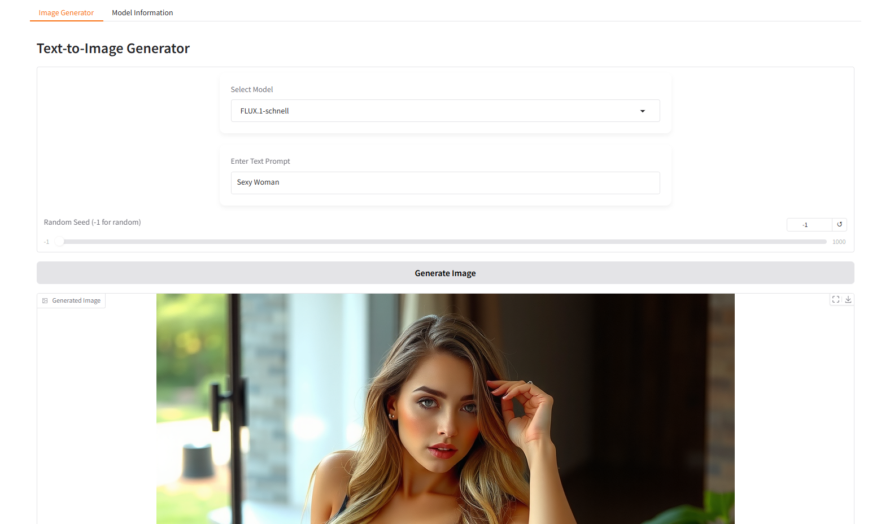

# Text-to-Image Generator with Diffusers and Gradio

This project provides a web application for generating images from text prompts using state-of-the-art diffusion models from the Hugging Face `diffusers` library. The interface is built with `gradio`, making it easy to interact with and explore different models and their capabilities.

## Features

*   **Multiple Model Support:** Choose from various pre-configured diffusion models, each with its unique strengths and styles. Currently supported models include:
    *   `FLUX.1-schnell`: Optimized for speed, ideal for rapid image generation.
    *   `FLUX.1-dev`: Focuses on detailed and artistically rich images, with support for LoRA (Low-Rank Adaptation) for enhanced styling.
    *   `Flux.1-lite-8B-alpha`: A lightweight model, balancing efficiency and ease of use.
*   **LoRA Support:**  `FLUX.1-dev` utilizes LoRA to infuse generated images with a specific artistic style triggered by the word "enrich art".
*   **Seed Control:**  Specify a random seed for reproducible results or leave it at -1 for a random seed each time.
*   **GPU Acceleration:**  Leverages GPU (if available) for faster generation.
*   **User-Friendly Interface:** Built with `gradio` for a simple and intuitive web interface.
*   **Model Information:** Provides detailed descriptions of each available model within the application.
*   **Model Pre-download:** All models are pre-downloaded when the application starts to ensure faster model switching during use.
*   **Dynamic Model Loading and Unloading**: Models are loaded into memory only when selected and unloaded when a different model is chosen, optimizing memory usage.

## Models Overview

The application features a diverse set of text-to-image generation models, each designed to meet different needs and creative visions. Here's a brief overview of each model:

### FLUX.1-schnell

**Description:** `FLUX.1-schnell` is a fast and efficient model designed for quick image generation. It excels at producing high-quality images rapidly, making it ideal for applications where speed is crucial. However, its rapid generation may slightly compromise on the level of detail compared to slower, more meticulous models.

### FLUX.1-dev

**Description:** `FLUX.1-dev` is a development model that focuses on delivering highly detailed and artistically rich images. It supports LoRA (Low-Rank Adaptation) to enhance the generated images with a specific artistic style, triggered by the word "enrich art" in the prompt. This model is perfect for users looking to create images with a distinct artistic flair.

### Flux.1-lite-8B-alpha

**Description:** `Flux.1-lite-8B-alpha` is a lightweight model optimized for efficiency and ease of use. It provides a balance between performance and resource consumption, making it suitable for a wide range of applications and users who prioritize accessibility and speed without sacrificing too much on image quality.

## Installation

### Prerequisites

*   Python 3.8+
*   `pip` package manager
*   A Hugging Face account and a User Access Token. [Sign up here](https://huggingface.co/join) and [create a token here](https://huggingface.co/settings/tokens).

### Steps

1.  **Clone the repository:**

    ```bash
    git clone <repository_url>  # Replace <repository_url> with the actual URL
    cd <repository_directory>   # Replace <repository_directory> with the cloned directory name
    ```

2.  **Create and activate a virtual environment (recommended):**

    ```bash
    python3 -m venv venv
    source venv/bin/activate  # On Linux/macOS
    venv\Scripts\activate    # On Windows
    ```

3.  **Install dependencies:**

    ```bash
    pip install -r requirements.txt
    ```
    The `requirements.txt` should contain:
    ```
    torch
    gradio
    diffusers
    transformers
    ```

4.  **Set your Hugging Face Token:**

    *   **Option 1: Environment Variable (Recommended for local use):**

        ```bash
        export HF_TOKEN="your_huggingface_token"
        ```

    *   **Option 2: Google Colab Secrets (If using Colab):**
        *   In your Colab notebook, go to "Tools" -> "Secrets".
        *   Add a new secret named `HF_TOKEN` and paste your Hugging Face token as the value.

        The code provided already handles fetching the token from Colab secrets, so no further action is required on your part if you use this option.

5. **Run the application:**
    *   Save the provided Python code as `app.py` (or a similar name).
    *   Execute the following command in your terminal:
    ```bash
    python app.py
    ```

## Usage

1.  Once the application is running, open your web browser and go to the provided URL (usually `http://127.0.0.1:7860`).

2.  **Select a Model:** Use the dropdown menu in the "Image Generator" tab to choose the desired diffusion model.

3.  **Enter Text Prompt:** Type your text prompt in the designated textbox. This is the description of the image you want to generate. Be as descriptive as possible for the best results.

4.  **Set Random Seed (Optional):** If you want to reproduce the same image later, set a specific seed value in the "Random Seed" slider. Use -1 for a random seed each time.

5.  **Generate Image:** Click the "Generate Image" button. The generated image will appear below, along with some runtime information (model used and seed).

6.  **Explore Model Information:** Navigate to the "Model Information" tab to learn more about each available model and its characteristics.

## Example Prompts

The application includes a few example prompts to get you started:

*   "Sexy Woman"
*   "Sexy girl"
*   "Future City"

Feel free to experiment with these prompts or create your own to explore the creative potential of the different models.

## Troubleshooting

*   **`HF_TOKEN` not found:** Ensure you have correctly set your Hugging Face token as an environment variable or in Colab secrets.
*   **Model loading errors:** Double-check your internet connection and ensure that the model IDs specified in the code are correct.
*   **Slow generation:** Image generation can be resource-intensive. Using a GPU will significantly improve performance. If you encounter slow generation times, consider using a smaller model or reducing the complexity of your prompts.
*   **Out of Memory Errors**: If you run out of memory, try using a smaller model, or restarting the runtime. When a model is selected that is different from the currently loaded one, the application automatically unloads the current model to free up memory.

## Credits

Created by Ruslan Magana Vsevolodovna.

Website: [https://ruslanmv.com/](https://ruslanmv.com/)

## License

This project is licensed under the [MIT License](LICENSE) - see the `LICENSE` file for details. (You would need to create a LICENSE file and add the MIT license text.)